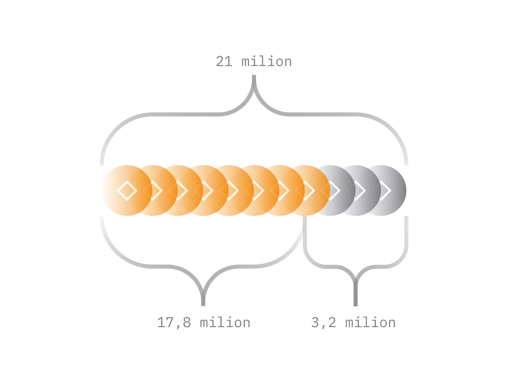
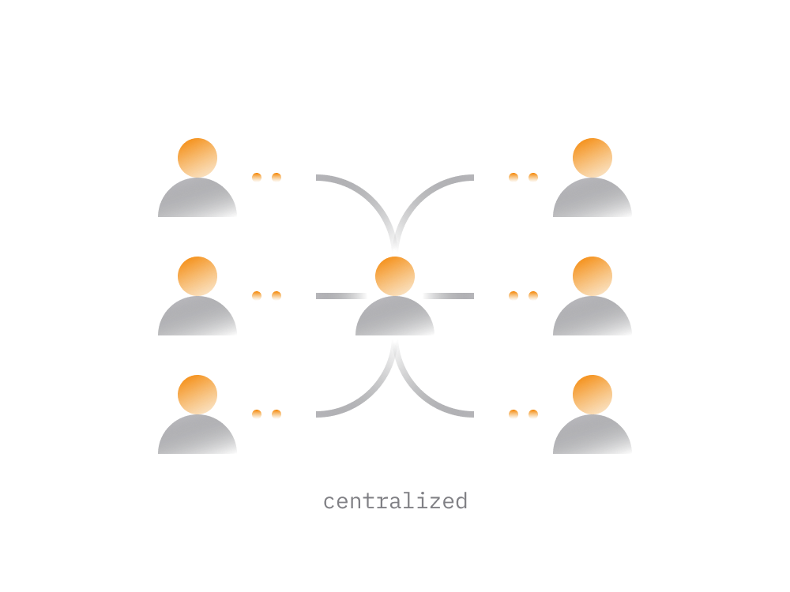
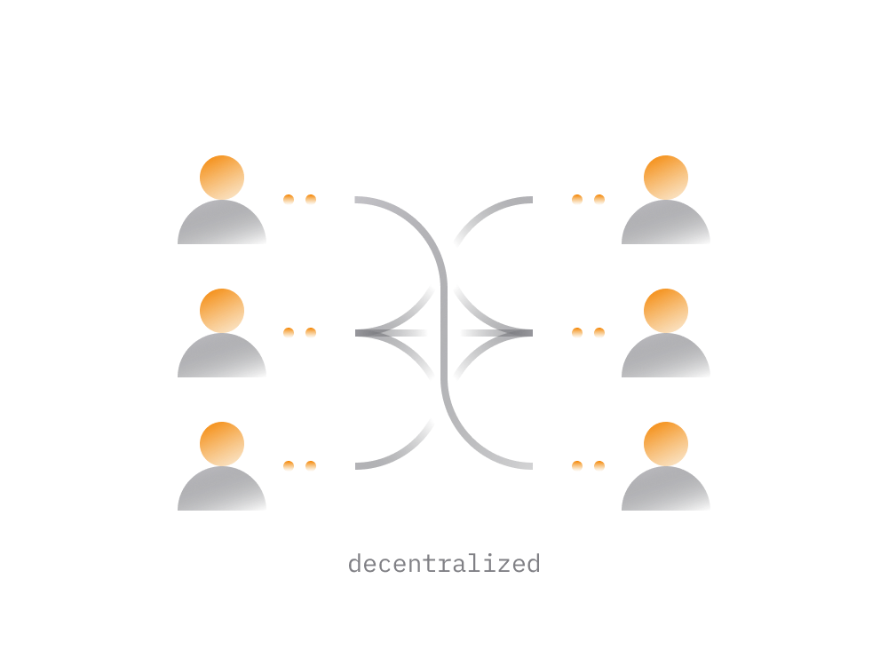
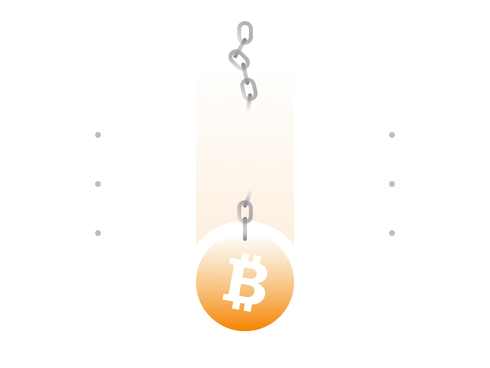
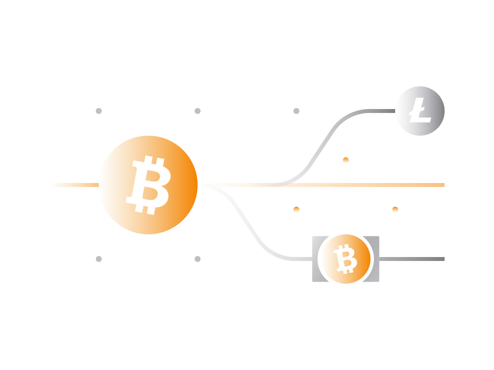
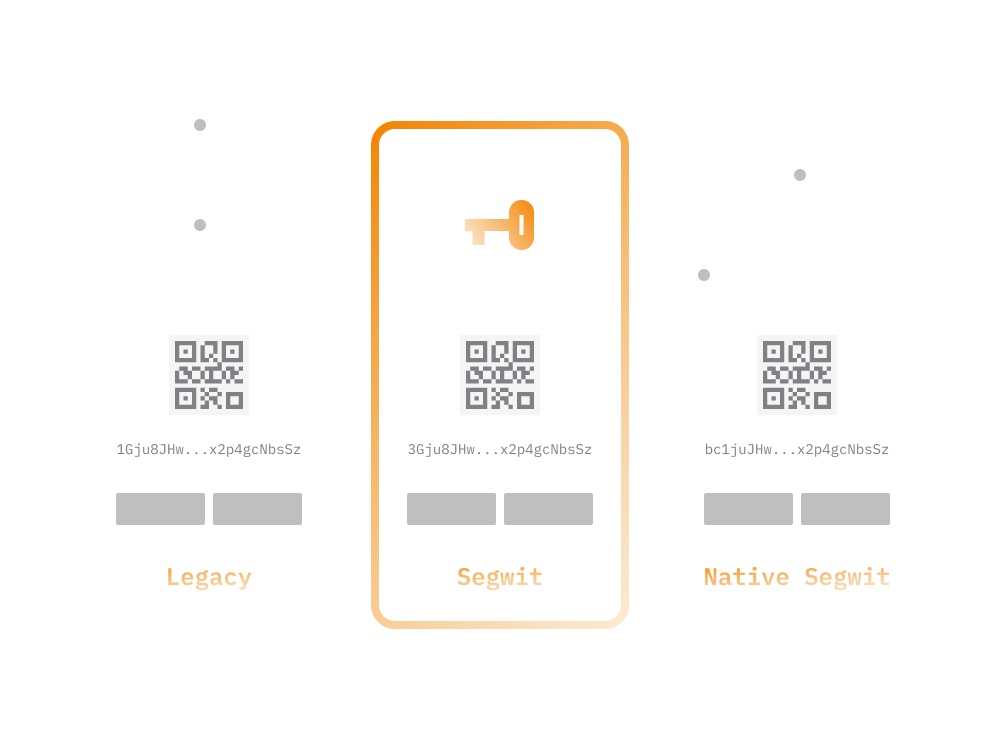

# Bitcoin In Simple Terms

Crypto newcomers have a mountain of questions.

- What is Bitcoin?
- How does it work?
- What makes it special?

The purpose of this guide is to answer those questions by introducing you to Bitcoin in simple terms and an easy-to-digest manner.

Over the last few years, Bitcoin network and its underlying cryptocurrency 'Bitcoin', has been labeled in many ways. It's been called everything from electronic cash to digital gold.

Increasingly people begin to perceive Bitcoin as wealth preservation instrument just like money, stocks or precious metals. The idea of having Bitcoin as another asset class doesn't seem too distant anymore.

Despite being around for 10 years, Bitcoin is still fairly complex and obscure to newcomers. Way until 2014 storing Bitcoin was not even a thing everyone could do. It has improved a lot since then but there are still complexities.

Most newcomers fail to grasp the value of the Bitcoin network on a first encounter. The Bitcoin often perceived purely as a cryptocurrency rather than a decentralized platform that can expand to host a large ecosystem of services.

## 1. Bitcoin Origins

The idea of Bitcoin was first proposed by [Satoshi Nakamoto](https://en.wikipedia.org/wiki/Satoshi_Nakamoto) back in 2008. Satoshi created a blueprint outlining the mechanics of a network where the value exchanging transactions can happen without the middle man.

> **The ideas put forward in the paper required a good understanding of the contemporary monetary system and graduate-level knowledge of mathematics, cryptography, and computer science.**

In the paper, Satoshi proposed Bitcoin as a decentralized network which :

- not reliant upon any entity to function
- functional and accessible 24/7
- enforces equal rules for all participants
- available for anyone unconditionally
- censorship-resistant

That's how the Bitcoin blockchain was born.

After Bitcoin made its debut the underlying blockchain technology spread to other projects resulting in other cryptocurrencies and decentralized systems.

Bitcoin was initially worthless; only a handful of people knew about it. In its early days, Bitcoin was mostly perceived as fun money for geeks rather than as something that could challenge the financial system.

The mainstream media played an influential role in shaping how the masses perceived Bitcoin in those first few years. Initially, nearly all media mentions of Bitcoin were negative. Indeed, the technology has been declared dead by various publications [nearly 400 times](https://99bitcoins.com/bitcoin-obituaries/)!

After a few years of growth via word-of-mouth marketing the Bitcoin turned into a massive phenomenon powered by a large network of users.

## 2. Bitcoin Cryptocurrency

As we have covered in our [guide on blockchains](../../fundamentals/en/1-cryptocurrency-basics.md), the cryptocurrency is a unit of measure on a blockchain.

The Bitcoin cryptocurrency, denoted by a BTC symbol, is the native unit of measurement on the Bitcoin blockchain.

Bitcoins are limited and scarce. Eventually, there will be 21 million Bitcoins in existence. The steps below outline how the Bitcoins were created and entered circulation.

- Starting from early 2009, Bitcoin blockchain started functioning and every 10 minutes the program powering the blockchain been adding certain amount of Bitcoins to the network. So far, nearly 18.5 million Bitcoins have been released to the market this way.

- Roughly every 10 minutes, new Bitcoins are created and awarded to one of the nodes operating on the Bitcoin network.

- The award goes to a node that is first to solve a mathematical problem successfully. Although all nodes are trying to solve it, only the first one gets the pay-out. The process of solving the mathematical problem is what essentially called as mining.

- The Bitcoin network will create the remaining three million Bitcoins over the next 130 years in a way described above.

- No single entity controls the release of new Bitcoins into circulation. It's an automated process that's regulated by algorithms that were coded into Bitcoin at the start of its existence.

It's estimated that about four million Bitcoins have been already lost. Typically, coins are lost because users have lost the wallets with Bitcoins on them without having a backup.

Out of 18.5 million Bitcoins created so far, roughly about 14 million are actually available for transacting.

## 3. Bitcoin As A Network

Usually, the term Bitcoin used as a reference to cryptocurrency on the Bitcoin network.

> **However, the Bitcoin is not just cryptocurrency. Bitcoin is a network, and an open platform for commerce where the value denominated in Bitcoin (BTC) units.**

Bitcoin network consists of various groups:

- parties running Bitcoin node software
- Bitcoin mining facilities and pools
- people accumulating Bitcoin in wallets
- anyone who transacts in Bitcoin
- engineers building services for Bitcoin

These are the people that drive the Bitcoin technology, adoption and demand for the Bitcoin cryptocurrency.

> **The systematic increase in the bitcoin price was ultimately due to the growing number of people interested in Bitcoin.**

Anyone can join the Bitcoin network and start transacting on it on equal terms as everyone else. Most Bitcoin users typically participate in the role of a wallet. They send and receive payments.

Some users participate by running a Bitcoin node hosting a live copy of the Bitcoin blockchain. Bitcoin nodes process and validate transactions from wallets. Nodes also keep the full history of transactions since very beginning.

> **The history of all Bitcoin transactions is also called the 'Bitcoin blockchain'.**
>
> **The Bitcoin blockchain is literally a chronological chain of blocks where each block holds a batch of transactions.**
>
> **A new block added to Bitcoin blockchain roughly every 10 minutes.**

Bitcoin network nodes ensure that only legitimate transactions are added to the blockchain.

Cumulatively, Bitcoin nodes guarantee the openness, availability, decentralization, and security of the Bitcoin network.

There are at least [10,000 nodes](https://bitnodes.io) powering the Bitcoin network at any given time. All working for keeping Bitcoin network accessible and running 24/7.

Anyone can set up a node without much effort. The node doesn't require any maintenance and can even operate on an old computer.

- As long as at least one Bitcoin node is online, the Bitcoin network will remain accessible for transactions.
- The more nodes there are on the network, the harder it is for an entity to cheat. The other nodes would all work against it.

While all nodes on Bitcoin network are equal, some nodes may do more things than others.

There are two main types:

- **Full Nodes**

  Full nodes keep a complete copy of the blockchain. Any full node can independently verify any transaction for validity.

- **Miner Nodes**

  All miner nodes continuously compete with each other to be the node that gets to add the next block to the blockchain. The miner node that is the first to solve a mathematical problem gets the associated Bitcoin reward. That's exactly how new Bitcoins added to circulation.

If you want to run a miner node for the sake of making some money, you need to consider the cost-efficiency of doing so. After taking electricity prices into account, you're very likely to lose money.

Mining is generally only profitable for people running specialized computers and who are buying electricity at industrial rates in countries like China.

## 4. Bitcoin Price

Back in the first few years, the idea that Bitcoin would someday be worth thousands of dollars appeared outlandish. One early adopter famously spent 10,000 BTC (around $100,000,000 USD at current prices) on a single pizza.

> **Fast-forward to June 2020, and Bitcoin is consistently trading around the $10,000 mark. It’s impressive, but in practice, the biggest challenge for Bitcoin was to grow from $0 to $100.**

Bitcoin broke $1,000 in 2014 and reached an all-time high of $20,000 just three years later, at the end of 2017. Bitcoin's price remains exceptionally volatile. Within nine months of its all-time high, the price had dropped back to $3,000.

Even though Bitcoin has a close to 150-200 billion market cap, it's still common to see a daily price swing above five percent.

The market cap of Bitcoin would need to hit the trillions before hype, panic, and large transactions would no longer affect the price.

These days, the perception of Bitcoin is very different from what it was 10 years ago. Nearly all mainstream financial channels regularly talk about Bitcoin. Wall Street and world leaders are all starting to take notice as well.

While the price reflects the market sentiment the technology around Bitcoin is being improved non-stop by engineers worldwide, regardless of price fluctuations.

In the ecosystem of cryptocurrencies the most valuable is usually considered to be the one with the largest network and community around it. Some cryptocurrencies may be very similar to Bitcoin and yet not able to compete with it price wise due to a much smaller network.

## 5. Why Bitcoin Growing

To understand what drives Bitcoin's growth, it's essential to look at Bitcoin as a social cause.

The technology seeks to provide a solution to some major socioeconomic and geopolitical problems, rather than merely being a new asset class.

> **Bitcoin is not only an improvement on how we perform financial transactions and preserve wealth. It's a whole new way to own and exercise control over assets.**

Unlike traditional financial instruments, which are generally imposed by governments or other centralized organizations, the core driving force of Bitcoin is its global community.

In the face of modern-day problems like money printing, currency debasements, over-regulation, sanctioning, growing number of people are moving towards Bitcoin. That trend in Bitcoin's popularity is likely to continue.

A widespread availability of cryptocurrency exchanges amid economic instability and currency debasements worldwide made it easier for people to acquire Bitcoins.

## 6. Is Bitcoin Stoppable?

A lot of new people entering the Bitcoin ecosystem remain skeptical about its ability to succeed.

The narrative is that one day Bitcoin (or a similar decentralized system) may replace centrally regulated financial institutions seems fanciful when the core beneficiaries of the current status quo are some of the most world's most powerful entities.

Many people also assume that governments are going to try banning Bitcoin. However, those beliefs are founded on a misunderstanding about how Bitcoin operates on a technical level.

> **The real question, do governments (or other organizations) have the ability to stop Bitcoin?**

Even if a government tries to outlaw Bitcoin, enforcing such a ban would be impossible. As long as there is electricity powering computers, phones, and other smart devices, the Bitcoin network can exist.

Yes, lawmakers can make it more difficult for people to participate in the network, but that is the extent of their power. Taking down the Bitcoin network would be more difficult than taking down the entire internet.

While modern-day regulators are able to censor what is being seen on search engines, YouTube, or in mainstream media, censoring access to Bitcoin network is a new
level of complexity.

The only way for the Bitcoin network to cease having any meaningful value is for everyone to stop using it. Such an outcome would only realistically occur if someone discovered an irreparable fundamental flaw in the code powering the Bitcoin network.

## 7. Bitcoin Problems

Despite Bitcoin network continuously growing there are some issues which can inhibit its future growth.

- **Bitcoin is slow**

  The underlying blockchain powering Bitcoin cannot currently process more than half a million transactions per day. While this aspect is being addressed on various fronts we are yet to see a widely adopted solution.

- **Bitcoin is complicated**

  Bitcoin is still fairly complicated to grasp for newcomers. A lot of people find the entry step to Bitcoin and other cryptocurrencies fairly complex. There is a barrier.

- **Lack of adoption**

  These days Bitcoin mainly used as a store of value or as an instrument for speculative trading. There is a growing need for more ways to be able to spend Bitcoins. The more ways there are to spend the Bitcoin the more attractive it becomes as payment option.

- **Lack of privacy**
  Bitcoin is not that private. The privacy aspect is expanded below, meanwhile it's suffice to say that in the world of cryptocurrencies Bitcoin ranks fairly weak on privacy. Using Bitcoin for anything illegal is a bad idea.

## 9. Bitcoin Forks

While learning about Bitcoin, crypto newcomers quickly discover about other cryptocurrencies.

- Some portray themselves as a better alternative to Bitcoin when it comes to privacy or scalability aspects. As you will find out below Bitcoin is not fully private and cryptocurrencies like, [Dash](https://www.dash.org), [Monero](https://www.getmonero.org) or [Zcash](https://z.cash) try to address this aspect.

- There are cryptocurrencies which emerged from the Bitcoin through a process knows as fork. Due to the open-source nature of Bitcoin, anyone with programming experience can create a Bitcoin-esque cryptocurrency with some modifications, then market it as a separate cryptocurrency. This group includes [Bitcoin Cash](bitcoin-cash.md) and [Litecoin](https://litecoin-foundation.org).

- There is a number of major cryptocurrencies which represent all-purpose blockchains that go beyond payment transfers. The most notable examples are [Ethereum](ethereum.md) and EOS cryptocurrencies.

- Finally, the largest segment of cryptocurrencies are known as tokens which are created on a blockchain like Ethereum. There are a number of widely used tokens which are created and successfully operate on top of Ethereum blockchain.

The most popular fork on Bitcoin is a cryptocurrency known as [Bitcoin Cash](bitcoin-cash.md). It succeeded in building strong community and gain significant market share. It actually emerged as a result of original Bitcoin community splitting into two camps in 2017.

> **The original Bitcoin---created by Nakamoto---has the ticker symbol BTC. It's generally referred to as Bitcoin, or Bitcoin classic.**
>
> **You might also see it called Bitcoin Core, which is the name of the program used to run a Bitcoin node on a computer.**

For a comprehensive list of all the cryptocurrencies in existence, check out [CoinMarketCap](https://coinmarketcap.com).

## 10. Storage & Usage

When you're ready to get involved with the Bitcoin on a practical level you're welcome to check out following guides:

1. [Cryptocurrency Explained](../../fundamentals/en/1-cryptocurrency-basics.md)
2. [Wallet Basics](../../fundamentals/en/2-wallets-basics.md)
3. [Private Keys Explained](../../fundamentals/en/3-private-keys-basics.md)
4. [Safe Storage Tips](../../fundamentals/en/4-safe-storage-basics.md)
5. [ROYALEX Wallet](../../fundamentals/en/5-unstoppable-basics.md)
6. [Buying Cryptocurrency](../../fundamentals/en/6-buying-cryptocurrency-basics.md)
7. [Spending Cryptocurrency](../../fundamentals/en/7-spending-cryptocurrency.md)
8. [Transactions Explained](../../fundamentals/en/8-transactions-basics.md)

## 11. Address Formats

Assuming you're familiar with the fundamentals related to storage and usage of cryptocurrencies there is one more thing to know about Bitcoin.

Here we focus on a practical knowledge you need to know when dealing with Bitcoin transactions and restoring your Bitcoin wallet in any wallet app.

Bitcoin has three commonly-used address formats that can be used to receive Bitcoin payments. Usually the wallet app handles this for you and just shows you the address.

> **Depending on the wallet app you use it may support receiving funds only to one of those formats or even all three formats.**

The new formats emerged as a result of more and more people transacting on the Bitcoin network. The newer address formats were introduced to make transaction sizes smaller and thus allow network to process more transactions in each block.

- **Legacy Address Format (or P2PKH)**

  The oldest address format, sometimes referred to as BIP44, usually starts with a number "1....". Being the oldest format most wallets support both receiving and sending payments to these addresses.

  The issue with such addresses are the higher transaction fees when transacting on Bitcoin network.

  Sending a payment from a wallet that holds funds previously received to a Legacy Address Format is more expensive than when the wallet uses other formats.

- **Segwit Address Format (or P2SH)**

  A more recent address format, sometimes referred to as BIP49, usually starts with a number "3....". Supported by many newer wallet apps.

  Sending a payment from a wallet that operates with funds received to SegWit addresses is cheaper when compared to legacy addresses.

- **Native-Segwit Address Format (bech 32)**

  The newest address format, and the cheapest to work with when it comes transacting on Bitcoin network. The bech32 address format starts with "bc1...".

There’s a good chance your preferred wallet or exchange doesn’t support at least one of these formats, with bech32 the likeliest to be omitted.

An easy way to find out would be to open your wallet app and check the first few symbols of the address wallet uses to receive Bitcoin.

On a practical level, apart from the difference in transaction fees there is just one thing to keep in mind. Knowing the address format is usually needed when restoring your Bitcoin wallet in a wallet app.

> **When restoring your Bitcoin wallet in some wallet app, along with the private key you also need to indicate the address format for the Bitcoin.**
>
> **Indicating an incorrect address format will result in wallet app not seeing your past transactions and hence the balance.**
>
> **Therefore, when setting app a new cryptocurrency wallet always make sure to note the Bitcoin address format used by the wallet.**
>
> **When restoring that wallet in the future, it should be restored the wallet app that claims to support the given address format.**

In that regard, the [ROYALEX wallet](https://cryptowallet.am) is able to both create and restore wallets operating in any of the three available address formats.

## 12. Bitcoin Privacy

Bitcoin is semi-private.

Although all transactions on the Bitcoin network are public, they appear as transactions from one Bitcoin address to another.

- there is no way to know the identity of the sender or recipient by looking at an individual transaction. The sender and the recipient can be the same person.

- by looking at addresses involved in transaction, it's possible to see other transactions where that address was involved in the past.

- if the user always used the same address for incoming transactions, anyone could lookup all those different transactions on a blockchain and tie them to the same person.

- if the wallet user uses a new address for each new transaction, then linking various different transactions to the same entity becomes impossible.

Remember, this is an entry-level guide. It is not a complete picture of Bitcoin's privacy features. For someone with a large amount of Bitcoins, or living in a hostile environment, several other factors should be taken into account.

## Conclusion

That's about it! Now you know all the essential information about owning and using Bitcoin.

If it has inspired you to learn more about the technical aspects of Bitcoin, we recommend that you read the excellent Mastering Bitcoin guide by [Andreas M. Antonopoulos](https://aantonop.com).

He's one of the world's foremost Bitcoin and blockchain experts.
